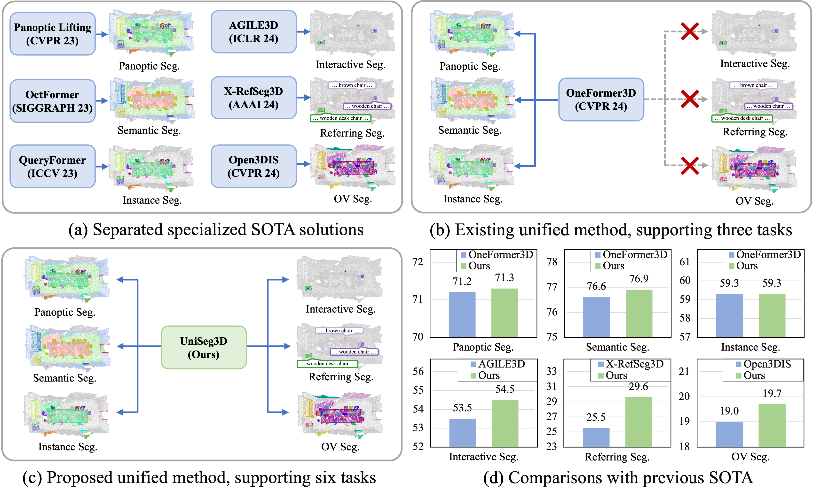
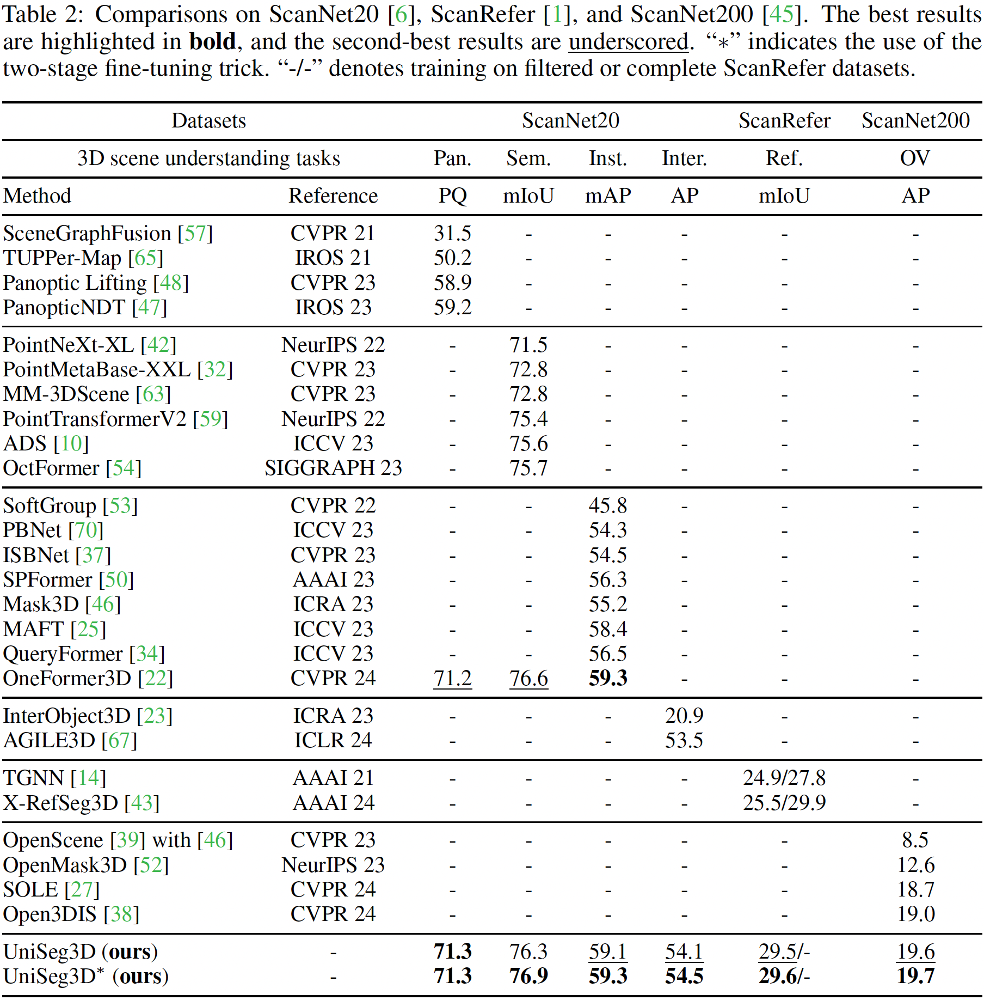

<div align="center">

# A Unified Framework for 3D Scene Understanding

#### [Wei Xu](https://scholar.google.com.hk/citations?hl=zh-CN&user=oMvFn0wAAAAJ)</sup>\*, [Chunsheng Shi](https://github.com/chunshengshi)</sup>\*, [Sifan Tu](https://github.com/SamorsetTuska), [Xin Zhou](https://lmd0311.github.io/), [Dingkang Liang](https://scholar.google.com/citations?user=Tre69v0AAAAJ&hl=zh-CN), [Xiang Bai](https://scholar.google.com/citations?user=UeltiQ4AAAAJ&hl=zh-CN)
Huazhong University of Science and Technology<br>
(*) equal contribution.

[[Project Page](https://dk-liang.github.io/UniSeg3D/)]  [[Arxiv Paper](https://arxiv.org/abs/2407.03263)]

</div>

## News
- **Nov-07-24**: Release the training code and log.
- **Sep-26-24**: UniSeg3D is accepted by NeurIPS 2024!
- **Jul-19-24**: Release the inference code and checkpoints.
- **Jul-03-24**: Release the [paper](https://arxiv.org/abs/2407.03263).

## Abstract
We propose UniSeg3D, a unified 3D segmentation framework that achieves panoptic, semantic, instance, interactive, referring, and open-vocabulary segmentation tasks within a single model. Most previous 3D segmentation approaches are typically tailored to a specific task, limiting their understanding of 3D scenes to a task-specific perspective. In contrast, the proposed method unifies six tasks into unified representations processed by the same Transformer. It facilitates inter-task knowledge sharing, thereby promoting comprehensive 3D scene understanding. To take advantage of multi-task unification, we enhance performance by leveraging inter-task connections. Specifically, we design knowledge distillation and contrastive learning methods to transfer task-specific knowledge across different tasks. Benefiting from extensive inter-task knowledge sharing, our UniSeg3D becomes more powerful. Experiments on three benchmarks, including ScanNet20, ScanRefer, and ScanNet200, demonstrate that the UniSeg3D consistently outperforms current SOTA methods, even those specialized for individual tasks. We hope UniSeg3D can serve as a solid unified baseline and inspire future work.

## Overview


## TODO
- [x] Release Inference Code.
- [x] Release Checkpoints.
- [x] Release Training Code and Training Log.
- [ ] Release Scripts for Open-Vocabulary Segmentation.
- [ ] Demo Code.

## Installation

- Python 3.10
- Pytorch 1.13
- CUDA 11.7

- Create a conda virtual environment
  ```
  conda create -n uniseg3d python=3.10
  conda activate uniseg3d
  ```
- Install [Pytorch 1.13](https://pytorch.org/)
  ```
  pip install torch==1.13.0+cu117 torchvision==0.14.0+cu117 torchaudio==0.13.0 --extra-index-url https://download.pytorch.org/whl/cu117
  ```

- Clone the repository
  ```
  git clone https://github.com/dk-liang/UniSeg3D.git
  ```

- Install the [OpenMMLab](https://github.com/open-mmlab) projects
  ```
  pip install mmengine==0.10.3
  pip install mmdet==3.3.0
  pip install git+https://github.com/open-mmlab/mmdetection3d.git@fe25f7a51d36e3702f961e198894580d83c4387b
  pip install mmcv==2.1.0 -f https://download.openmmlab.com/mmcv/dist/cu117/torch1.13.0/index.html
  ```

- Install the [MinkowskiEngine](https://github.com/NVIDIA/MinkowskiEngine)
  ```
  conda install openblas-devel -c anaconda

  git clone https://github.com/NVIDIA/MinkowskiEngine.git
  cd MinkowskiEngine
  python setup.py install --blas_include_dirs=${CONDA_PREFIX}/include --blas=openblas
  ```

- Install segmentator from the [segmentator](https://github.com/Karbo123/segmentator)
  ```
  git clone https://github.com/Karbo123/segmentator.git

  cd segmentator && cd csrc && mkdir build && cd build

  cmake .. \
  -DCMAKE_PREFIX_PATH=`python -c 'import torch;print(torch.utils.cmake_prefix_path)'` \
  -DPYTHON_INCLUDE_DIR=$(python -c "from distutils.sysconfig import get_python_inc; print(get_python_inc())")  \
  -DPYTHON_LIBRARY=$(python -c "import distutils.sysconfig as sysconfig; print(sysconfig.get_config_var('LIBDIR'))") \
  -DCMAKE_INSTALL_PREFIX=`python -c 'from distutils.sysconfig import get_python_lib; print(get_python_lib())'` 

  make && make install # after install, please do not delete this folder (as we only create a symbolic link)
  ```

- Install the dependencies
  ```
  pip install spconv-cu117
  pip install torch-scatter==2.1.1 -f https://data.pyg.org/whl/torch-1.13.0+cu117.html
  pip install numpy==1.26.4
  pip install timm==0.9.16
  pip install ftfy==6.2.0
  pip install regex==2023.12.25
  ```

## Dataset

- Download ScanNet v2 data [HERE](https://github.com/ScanNet/ScanNet). Link or move the `scans` and `scans_test` folders to `data/scannet`.

- In this directory, extract point clouds and annotations by running `python batch_load_scannet_data.py`.
  ```
  cd data/scannet
  python batch_load_scannet_data.py
  ```

- Enter the project root directory, generate training data by running
  ```
  python tools/create_data.py scannet --root-path ./data/scannet --out-dir ./data/scannet --extra-tag scannet
  ```

- Download the processed train-set data infos `uniseg3d_infos_train.pkl` from [link](https://github.com/dk-liang/UniSeg3D/releases/download/v1.0/uniseg3d_infos_train.pkl), and put it into `data/scannet`.<br>
  Note: The `uniseg3d_infos_train.pkl` contains:
  - ScanNet dataset information.
  - Text prompts extracted from the ScanRefer dataset.
  - Tokenized text prompts using the [OpenCLIP](https://github.com/lxtGH/OMG-Seg/tree/main/ext/open_clip).
  - Pseudo segmentation masks predicted by [SAM3D](https://github.com/Pointcept/SegmentAnything3D).

- Download the processed val-set data infos `uniseg3d_infos_val.pkl` from [link](https://github.com/dk-liang/UniSeg3D/releases/download/v1.0/uniseg3d_infos_val.pkl), and put it into `data/scannet`.<br>
  Note: The `uniseg3d_infos_val.pkl` contains:
  - ScanNet dataset information.
  - Text prompts extracted from the ScanRefer dataset.
  - Tokenized text prompts using the [OpenCLIP](https://github.com/lxtGH/OMG-Seg/tree/main/ext/open_clip).

- Download processed class embeddings `scannet_cls_embedding.pth` from [link](https://github.com/dk-liang/UniSeg3D/releases/download/v1.0/scannet_cls_embedding.pth), and put it into `data/scannet`.
  Note: The `scannet_cls_embedding.pth` contains:
  - Processed ScanNet class embeddings using the [OpenCLIP](https://github.com/lxtGH/OMG-Seg/tree/main/ext/open_clip).

The directory structure after pre-processing should be as below:
```
UniSeg3D
├── data
│   ├── scannet
│   │   ├── meta_data
│   │   ├── batch_load_scannet_data.py
│   │   ├── load_scannet_data.py
│   │   ├── scannet_utils.py
│   │   ├── scans
│   │   ├── scans_test
│   │   ├── scannet_instance_data
│   │   ├── points
│   │   │   ├── xxxxx.bin
│   │   ├── instance_mask
│   │   │   ├── xxxxx.bin
│   │   ├── semantic_mask
│   │   │   ├── xxxxx.bin
│   │   ├── super_points
│   │   │   ├── xxxxx.bin
│   │   ├─ uniseg3d_infos_train.pkl
│   │   ├─ uniseg3d_infos_val.pkl
│   │   ├─ scannet_cls_embedding.pth
```

## Training

- Download pretrained CLIP model `open_clip_pytorch_model.bin` from [OpenCLIP](https://huggingface.co/laion/CLIP-convnext_large_d_320.laion2B-s29B-b131K-ft-soup/blob/main/open_clip_pytorch_model.bin), and put it into `work_dirs/pretrained/convnext_large_d_320`.

- Download pretrained [SSTNet](https://github.com/Gorilla-Lab-SCUT/SSTNet) model `sstnet_scannet.pth` from [link](https://github.com/dk-liang/UniSeg3D/releases/download/v1.0/sstnet_scannet.pth), and put it into `work_dirs/pretrained`.

- Running the following instruction to train the UniSeg3D:
  ```shell
  CUDA_VISIBLE_DEVICES=0 ./tools/dist_train.sh \
  configs/uniseg3d_1xb4_scannet_scanrefer_scannet200_unified.py \
  1
  ```

## Inference

- Download pretrained CLIP model `open_clip_pytorch_model.bin` from [OpenCLIP](https://huggingface.co/laion/CLIP-convnext_large_d_320.laion2B-s29B-b131K-ft-soup/blob/main/open_clip_pytorch_model.bin), and put it into `work_dirs/pretrained/convnext_large_d_320`.

- Put [checkpoint](https://github.com/dk-liang/UniSeg3D/releases/download/v1.0/model_best_2.pth) into `work_dirs/ckpts`.

- Running the following instruction to evaluate the ckpts:
  ```shell
  CUDA_VISIBLE_DEVICES=0 ./tools/dist_test.sh \
  configs/uniseg3d_1xb4_scannet_scanrefer_scannet200_unified.py \
  work_dirs/ckpts/model_best_2.pth \
  1
  ```
  Note: The PS, SS, IS, Interactive, Referring segmentation tasks are evaluated in once inference. The evaluation scripts for the OVS task will be released later.

## Models

<table style="border-collapse: collapse; text-align: center; vertical-align: middle;">
  <tr>
    <th style="text-align: center; vertical-align: middle;">Dataset</th>
    <th colspan="4" style="text-align: center; vertical-align: middle;">ScanNet20</th>
    <th style="text-align: center; vertical-align: middle;">ScanRefer</th>
    <th style="text-align: center; vertical-align: middle;">ScanNet200</th>
    <th colspan="2" style="text-align: center; vertical-align: middle;">Download</th>
  </tr>
  <tr>
    <th style="text-align: center; vertical-align: middle;">Task</th>
    <th style="text-align: center; vertical-align: middle;">Pan.</th>
    <th style="text-align: center; vertical-align: middle;">Sem.</th>
    <th style="text-align: center; vertical-align: middle;">Inst.</th>
    <th style="text-align: center; vertical-align: middle;">Inter.</th>
    <th style="text-align: center; vertical-align: middle;">Ref.</th>
    <th style="text-align: center; vertical-align: middle;">OV</th>
    <th style="text-align: center; vertical-align: middle;">ckpt</th>
    <th style="text-align: center; vertical-align: middle;">log</th>
  </tr>
  <tr>
    <td align="center">Metric</td>
    <td align="center">PQ</td>
    <td align="center">mIoU</td>
    <td align="center">mAP</td>
    <td align="center">AP</td>
    <td align="center">mIoU</td>
    <td align="center">AP</td>
    <td align="center">-</td>
    <td align="center">-</td>
  </tr>
  <tr>
    <td align="center">UniSeg3D</td>
    <td align="center">71.3</td>
    <td align="center">76.3</td>
    <td align="center">59.1</td>
    <td align="center">54.1</td>
    <td align="center">29.5</td>
    <td align="center">19.6</td>
    <td align="center"><a href="https://github.com/dk-liang/UniSeg3D/releases/download/v1.0/model_best.pth">link</a></td>
    <td align="center"><a href="https://github.com/dk-liang/UniSeg3D/releases/download/v1.0/model_best.log">link</a></td>
  </tr>
  <tr>
    <td align="center">UniSeg3D<sup>*<sup></td>
    <td align="center">71.3</td>
    <td align="center">76.9</td>
    <td align="center">59.3</td>
    <td align="center">54.5</td>
    <td align="center">29.6</td>
    <td align="center">19.7</td>
    <td align="center"><a href="https://github.com/dk-liang/UniSeg3D/releases/download/v1.0/model_best_2.pth">link</a></td>
    <td align="center">-</td>
  </tr>
</table>

## Experiment


## Visulizations on six 3D segmentation tasks


## 🙏 Acknowledgement
We are thankful to [SPFormer](https://github.com/sunjiahao1999/SPFormer), [OneFormer3D](https://github.com/oneformer3d/oneformer3d), [Open3DIS](https://github.com/VinAIResearch/Open3DIS) and [OMG-Seg](https://github.com/lxtGH/OMG-Seg) for releasing their models and code as open-source contributions.

## Citation
```
@inproceedings{xu2024unified,
      title={A Unified Framework for 3D Scene Understanding},
      author={Xu, Wei and Shi, Chunsheng and Tu, Sifan and Zhou, Xin and Liang, Dingkang and Bai, Xiang},
      booktitle={Advances in Neural Information Processing Systems},
      year={2024}
}
```
